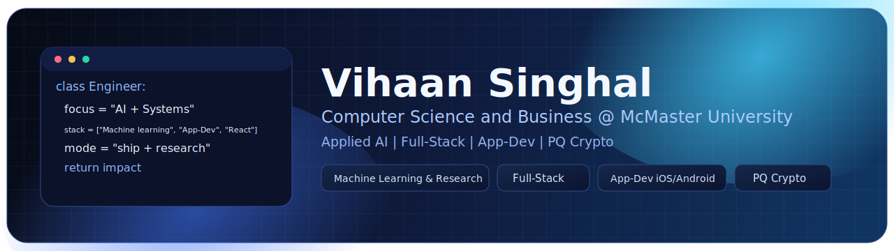
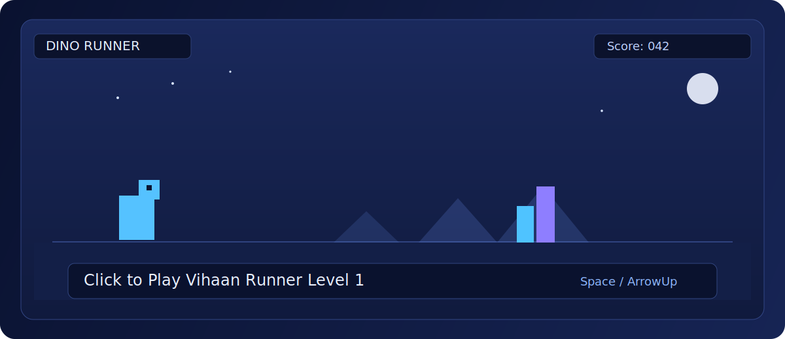

<!-- Section: Header -->

  

<!-- Section: Typing -->

  

<!-- Section: Links -->

  
  

<!-- Section: Visual -->

  

<!-- Section: About -->

## About

I am a developer and applied AI builder focused on machine learning, secure systems, and end-to-end product development.
My work spans deepfake detection research, post-quantum cryptography experiments, full-stack web apps, and cross-platform mobile development.
I also contribute to projects at McMaster Artificial Intelligence Society, with experience in data pipelines, deployment workflows, and model benchmarking.

<!-- Section: Stack -->

## Tech Stack

### Languages, Markup & Scripting

  
  
  
  
  
  
  
  
  
  
  
  
  
  
  

### Frameworks, Platforms & Libraries

  
  
  
  
  
  
  
  
  
  
  
  
  
  
  

### AI / ML / Computer Vision

  
  
  
  
  
  
  
  
  

### Databases

  
  
  
  
  
  

### Cloud & DevOps

  
  
  
  
  
  
  
  
  
  

### Mobile Platforms

  
  

### Cryptography

  
  

<!-- Section: Fun -->

## Playable Mini Game

  

  
  

  Controls: Space / Arrow Up / tap to jump, R to restart.

<!-- Section: Graphic -->

## Activity Graphic

  

